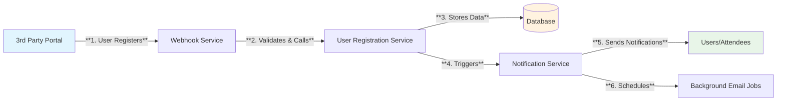
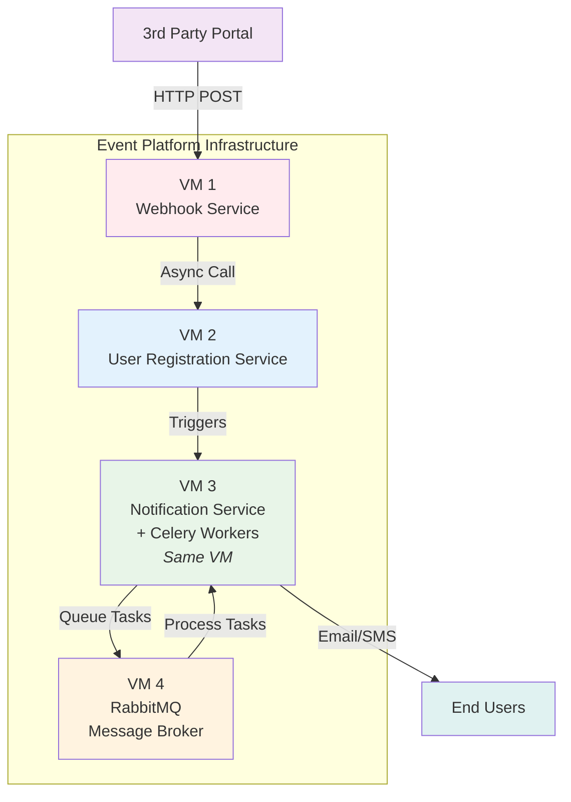

# Event Platform Development Experience

## Company Background

I worked at a **startup** event platform company that creates digital platforms for various events. The company operates as a **B2B service provider**, not as an event organizer. We developed mobile applications and web applications for attendees and speakers, without directly connecting to end users.

## My Role and Responsibilities

I worked there for **2.5 years**, starting as a **Software Engineer for 1.5 years** and then getting promoted to **Tech Lead for the final year**. I was part of a **4-person full-time team** responsible for three core services:
- **User Registration Service**
- **Notification Service** 
- **Webhook Service**

The entire system was built using **Python** and represented **legacy maintenance work** - we inherited the existing architecture and focused on keeping it running while adding new features.

## System Architecture and Flow

### User Registration Flow

The registration process follows this sequence:

**Step 1**: Attendees register through external portal  
**Step 2**: Third party calls our webhook endpoint  
**Step 3**: Webhook service validates and calls registration service (asynchronously)  
**Step 4**: Registration service processes data, stores in database, then triggers notifications

### Infrastructure Setup

The system was deployed across 4 VMs (not fully distributed):
- **VM 1**: Webhook Service
- **VM 2**: User Registration Service  
- **VM 3**: Notification Service and Celery workers (both running on the same VM)
- **VM 4**: RabbitMQ message broker

## Technology Stack

- **Message Queue**: RabbitMQ
- **Background Jobs**: Celery 3.x
- **Task Processing**: Asynchronous job execution for notifications and scheduled email reminders
- **Programming Language**: Python across all services

## Identified Issues and Impact

### Missing Retry Mechanism
The most critical issue was the **lack of retry mechanism**. When notification delivery failed, we had no way to:
- Detect failed notifications
- Retry failed deliveries
- Track failure rates

### Monitoring Challenges
- **No visibility** into failed notification tasks
- **Manual queue inspection** required using RabbitMQ CLI
- **No metrics** on queue depth or processing status
- **Reactive problem detection** only when attendees/speakers reported missing notifications

### Business Impact
The technical issues had real business consequences:
- **Customer complaints** from attendees who didn't receive event notifications
- **Revenue risk** as event organizers considered switching to competitors due to reliability issues
- **Team productivity loss** from constant firefighting instead of feature development

### Discovery Process
We discovered these issues primarily through **user reports** rather than proactive monitoring. We had no systematic way to detect problems before they impacted end users, which meant we were always in reactive mode.

## Looking Back: How I Would Improve This Architecture Today

**Note**: This analysis represents my current expertise reflecting on past work. During my time at the company, I was focused on keeping the system running and didn't have the knowledge to identify or propose these solutions. This is my growth journey - understanding what I've learned since then.

The architecture had significant room for enhancement, which I now categorize into improvement phases:

### Short Term Improvements

#### 1. Implement Retry Mechanism
**Problem**: No retry mechanism for failed notifications, causing lost messages without visibility.

**Proposed Solution**: Implement a hybrid approach combining Celery retries with RabbitMQ dead letter queues.

**Reasoning**: This dual approach addresses both immediate and long-term needs. Celery's automatic retries with exponential backoff handle transient failures (network timeouts, temporary service unavailability), while dead letter queues capture permanently failed messages for analysis. The exponential backoff prevents overwhelming downstream services during outages.

**Expected Benefits**: 
- Immediate improvement in notification delivery success rates
- Visibility into failure patterns through dead letter queue analysis
- Reduced manual intervention for transient issues
- Foundation for understanding systemic problems

**Trade-offs**: Adds complexity to the system and requires additional queue management, but the reliability gains justify the operational overhead.

#### 2. Enable RabbitMQ Management Plugin
**Problem**: No visibility into queue status, message counts, or processing rates.

**Proposed Solution**: Install and configure RabbitMQ Management Plugin for web-based monitoring.

**Reasoning**: This provides immediate operational visibility with minimal system changes. The plugin offers real-time insights into queue depths, message rates, and connection status without requiring additional infrastructure or code changes.

**Expected Benefits**:
- Real-time queue monitoring via web interface
- Ability to identify bottlenecks and processing delays
- Historical data for capacity planning
- Quick troubleshooting during incidents

**Trade-offs**: Minimal - only adds slight overhead to RabbitMQ but provides significant operational value.

#### 3. Implement Proper Error Handling and Logging
**Problem**: Inconsistent error handling across services, requiring manual VM checks for troubleshooting.

**Proposed Solution**: Standardize error handling with structured logging using consistent error codes and formats across all services.

**Reasoning**: Consistent error patterns make troubleshooting faster and enable automated analysis. Structured logging facilitates future centralized log aggregation and helps identify recurring issues across the distributed system.

**Expected Benefits**:
- Faster problem identification and resolution
- Consistent troubleshooting experience across services
- Better data for understanding failure patterns
- Preparation for future centralized logging

**Trade-offs**: Requires refactoring existing error handling code, but the investment pays off quickly in reduced debugging time.

### Medium to Long Term Improvements

#### 1. Centralized Logging System
**Problem**: Logs scattered across multiple VMs, making troubleshooting time-consuming and inefficient.

**Proposed Solution**: Implement centralized logging using ELK Stack (Elasticsearch, Logstash, Kibana) or Sentry.

**Reasoning**: The current approach of checking individual VMs doesn't scale and wastes valuable debugging time. Centralized logging enables correlation analysis across services, which is crucial for understanding complex distributed system issues. ELK Stack provides powerful search and visualization capabilities, while Sentry offers excellent error tracking and alerting.

**Expected Benefits**:
- Single point of access for all system logs
- Advanced search and filtering capabilities
- Cross-service correlation analysis
- Real-time log streaming and alerts
- Historical trend analysis

**Trade-offs**: Requires significant infrastructure investment and ongoing maintenance, but essential for operational maturity at scale.

#### 2. Monitoring and Alerting System
**Problem**: Reactive problem detection only when users report issues.

**Proposed Solution**: Implement comprehensive monitoring using Prometheus + Grafana with custom metrics for notification success rates, queue depths, and processing times.

**Reasoning**: Proactive monitoring is essential for maintaining service reliability. By tracking key business metrics (notification delivery rates) alongside technical metrics (queue depths, processing times), we can detect issues before they impact users. Automated alerting enables faster response times and reduces the blast radius of incidents.

**Expected Benefits**:
- Proactive issue detection before user impact
- Data-driven capacity planning and optimization
- Clear visibility into system performance trends
- Automated escalation for critical issues
- Better understanding of system behavior under load

**Trade-offs**: Requires additional infrastructure and alert management overhead, but prevents costly user-facing incidents.

#### 3. Circuit Breaker Implementation
**Problem**: Potential cascade failures when external notification services are down.

**Proposed Solution**: Implement circuit breaker pattern for external service calls with graceful degradation strategies.

**Reasoning**: External dependencies (email providers, SMS gateways) will occasionally fail. Without circuit breakers, these failures can cascade through our system, causing broader outages. Circuit breakers prevent this by failing fast and providing fallback mechanisms, maintaining overall system stability.

**Expected Benefits**:
- Prevention of cascade failures during external service outages
- Faster recovery times when services come back online
- Graceful degradation of functionality rather than complete failure
- Better user experience during partial outages
- Improved system resilience and reliability

**Trade-offs**: Adds complexity to service integration logic and requires careful tuning of thresholds, but essential for production resilience in distributed systems.

## Personal Reflection: What This Experience Taught Me

### The Reality Check
Looking back at this experience with **current expertise** - now **3 years since leaving the company** - I can clearly see the gaps that existed in our system. Gaps that I simply **didn't recognize during my 2.5 years there**. Back then, I was a junior engineer focused on making features work and keeping the system running. The sophisticated solutions I've outlined above? **I had no idea they even existed**.

### The Learning Journey Over 3 Years
This experience represents a significant part of my **growth as an engineer over the past 3 years**. Here's what I've learned since leaving:

**From Reactive to Proactive Thinking**: Back then, we were constantly in firefighting mode. I now understand that **good engineering prevents fires rather than just fighting them**. Monitoring, observability, and retry mechanisms aren't "nice-to-haves" - they're fundamental to reliable systems.

**From Code-First to Systems Thinking**: I used to think my job was to write working code. Now I understand that **sustainable software engineering requires thinking about the entire system lifecycle** - from development to operations to maintenance.

### Key Insights I've Gained

**Monitoring is Not Optional**: The biggest lesson from constantly reacting to user complaints was that **you can't improve what you can't measure**. Every system should have observability built in from day one.

**Simple Solutions Often Win**: Many of our problems could have been solved with relatively simple implementations (basic retry logic, structured logging). I've learned that **perfect is the enemy of good**, especially in resource-constrained environments.

**Business Impact Drives Technical Decisions**: Understanding that our technical problems led to customer complaints and revenue risk taught me to **always connect technical decisions to business outcomes**.

**Growth Comes from Reflection**: This analysis itself is part of my growth process - **looking back with current knowledge helps identify learning opportunities** and solidify lessons learned.

### How This Shaped My Current Approach

Today, when I approach any new system or project, I ask different questions:
- **"How will we know when this breaks?"** (Monitoring first)
- **"What happens when external dependencies fail?"** (Resilience patterns)
- **"How will we debug issues in production?"** (Observability design)
- **"What's the business impact of this technical choice?"** (Outcome-focused decisions)

### The Growth Mindset
This experience taught me that **engineering expertise isn't just about knowing the latest technologies** - it's about understanding systems, anticipating problems, and designing for maintainability. The gap between my knowledge during those 2.5 years at the startup and now, 3 years later, represents continuous learning, and I know this growth journey will continue.

**The most valuable lesson**: Every challenging experience, even those where we didn't have all the answers, becomes a foundation for future wisdom. This startup experience with its constraints and challenges was invaluable preparation for the more complex systems I've worked with over the past 3 years.

## The Growth Summary: From Reactive Developer to Systems Thinker

This experience represents more than just technical learning - it's a fundamental shift in how I approach software engineering:

### Then vs. Now

**5.5 Years Ago (When I Started at the Company)**:
- Fresh engineer focused on making individual features work
- Completely reactive approach to problems
- No awareness of monitoring, observability, or system design patterns
- Thought my job was just writing code that worked

**3 Years Ago (When I Left the Company)**:
- Had grown to Tech Lead but still primarily reactive
- Understood some system interactions but lacked broader architectural thinking
- Beginning to see patterns but didn't know how to address them systematically

**Today (3 Years Later)**:
- Design systems with failure modes and observability in mind from day one
- Proactively prevent issues through monitoring and resilience patterns
- Understand that operational excellence is every engineer's responsibility
- View technical debt as a conscious trade-off that needs active management
- Measure success by system reliability and long-term maintainability

### The Transformation

What started as a **fresh engineer** dealing with daily firefighting, progressed to a **reactive Tech Lead**, and has now evolved into a **proactive systems thinker** who designs for sustainability. This analysis of my past work isn't just an academic exercise - it's proof that **experience + reflection + time = wisdom**.

The gap between what I knew during those 2.5 years at the startup and what I know now, 3 years later, represents **thousands of hours of learning**: working on different systems at subsequent companies, reading about distributed systems, implementing monitoring in real projects, dealing with production outages, and most importantly, **learning from each failure and success**.

In the 3 years since leaving this startup, I've had the opportunity to work on larger-scale systems where I've implemented many of these observability and reliability patterns, validating that these approaches do indeed solve the problems I identified back then.

### Why This Matters

This growth journey demonstrates that **engineering maturity isn't about knowing everything from the start** - it's about:
- Learning from each experience
- Honestly assessing past work
- Applying new knowledge to understand old problems
- Continuously evolving your approach

**This experience taught me that great engineers aren't those who never make mistakes, but those who learn from every system they touch and carry those lessons forward.**

Looking back at this notification system with current eyes - 3 years of additional experience later - reminds me how far I've come and motivates me to keep growing, because I know that five years from now, I'll look at today's work with the same analytical perspective, finding new areas for improvement and growth.