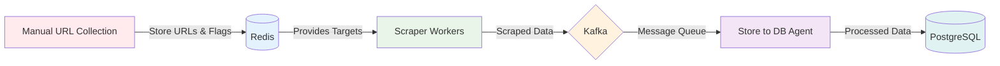
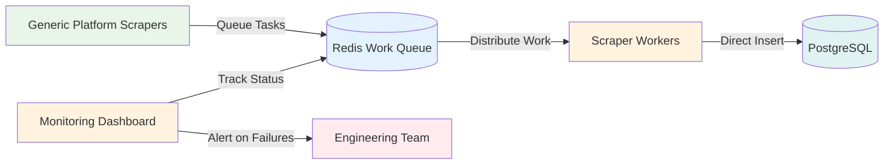

## Company Background

I worked as a freelancer for a **B2C startup e-commerce company** that operated as a **cross-border retail platform**. The business model involved sourcing and selling items from major overseas e-commerce platforms like **Amazon, Target, Saks Fifth Avenue, Macy's, and Lego** to Indonesian customers. This was particularly valuable in **2018 when importing items from overseas e-commerce was extremely challenging** for Indonesian consumers.

The company aimed to bridge this gap by creating a local e-commerce platform stocked with popular international products, handling the complex import logistics on behalf of customers.

## My Role and Timeline

I joined the project in **January 2019**, about **4 months after the project started in September 2018**. I worked as a **freelancer for 2-3 months** on a **2-person scraping team**. My specific responsibilities included:

- **Generating scrape components** for extracting product data (price, name, images, descriptions)
- **Small bug fixes** when scraping logic broke
- **CSS selector maintenance** when target sites updated their layouts

At the time, I was a **junior developer** with limited experience - my background was mainly in basic API development, and this was my **first exposure to distributed systems, Redis, Kafka, and worker-based architectures**.

The system was already built when I joined, so my role was primarily **using and maintaining the existing architecture** rather than designing it from scratch.

## System Architecture and Flow

### Data Scraping Pipeline

The system followed this workflow:

**Step 1**: Manual collection of item category URLs from target e-commerce sites  
**Step 2**: Storage in Redis with metadata (category, URL, scraping status, DB storage status)  
**Step 3**: Scraper workers pull targets from Redis and extract item details using CSS selectors  
**Step 4**: Scraped data sent to Kafka message queue  
**Step 5**: Store to DB agents consume from Kafka and persist to PostgreSQL

### Technology Stack and Infrastructure

- **Programming Language**: Pure Python across all components
- **Message Queue**: Kafka for data streaming between scraper and storage
- **Cache/Coordination**: Redis for URL management and worker coordination
- **Database**: PostgreSQL for final product data storage
- **Processing**: Worker-based architecture for parallel scraping
- **Scale Design**: Architected to handle **10M+ items/day** but processing **<100K items/day**

## My Workflow and Responsibilities

### Manual Data Collection Process

My primary workflow involved **manually collecting and configuring scraping targets**:

1. **URL Collection**: Visited each target e-commerce site and identified **50+ item category URLs**
2. **CSS Selector Development**: Analyzed HTML structure to determine precise CSS selectors for:
    - Product names
    - Pricing information
    - Product images
    - Descriptions and specifications
3. **Configuration Setup**: Created scraper configurations following existing conventions:
    - Files must contain 'etl' in filename
    - CSS-based extraction only (no XPath allowed)
    - Predefined structure for item detail extraction paths

### Daily Maintenance Challenges

The most time-consuming aspect was **CSS selector maintenance**. After a few weeks, e-commerce sites would update their layouts, causing:

- **Missing product information** when selectors no longer matched elements
- **Data extraction failures** requiring immediate fixes
- **Repetitive debugging** to identify which selectors broke and why

## Identified Issues and Architecture Analysis

### Onboarding and Knowledge Transfer Problems

The biggest initial challenge was **inadequate system documentation**. When I joined:

- **No comprehensive README** or system overview documentation
- **Limited knowledge transfer** - only tool usage explained, not system architecture
- **No troubleshooting guides** for common scraping failures
- Had to **reverse-engineer the entire codebase** to understand component interactions

### Technical Architecture Issues

#### 1. CSS Selector Brittleness

**Problem**: CSS selectors frequently broke when e-commerce sites updated their layouts.

**Real Impact**: After a few weeks of operation, target sites would change their CSS classes, leading to **missing product information and data extraction failures**. This required constant manual intervention to update selectors across multiple scraper configurations.

#### 2. Over-Engineered Infrastructure for Scale

**Problem**: The system was designed for **10M+ items/day** but only processing **<100K items/day**.

**Business Impact**: This architectural mismatch likely resulted in **significantly higher infrastructure costs** for a startup that was still establishing revenue streams. The complex Kafka-based pipeline added operational overhead without corresponding benefits at the current scale.

#### 3. Manual Configuration Overhead

**Problem**: Each item category required individual scraper configuration instead of reusable templates.

**Operational Impact**: **Manual URL collection and CSS selector configuration** for every new category, making expansion to new product lines labor-intensive and error-prone.

## Looking Back: How I Would Improve This System Today

**Note**: This analysis reflects my current expertise as a **Software Engineer** where I work with Redis, Kafka, and distributed systems daily. During my freelance project in 2019, I was discovering these technologies for the first time. This represents my growth over the past **6 years** in various software engineering roles.

### Short Term Improvements

#### 1. Implement XPath Support with CSS Fallback

**Problem**: CSS selectors are fragile and frequently break with minor HTML changes, requiring constant maintenance.

**Proposed Solution**: Add XPath selector support as the primary extraction method, with CSS selectors as fallback when XPath fails.

**Reasoning**: XPath selectors target elements based on structural relationships and are generally more stable than class-based CSS selectors. E-commerce sites frequently update CSS classes for styling but rarely change fundamental HTML structure. A dual approach provides redundancy and significantly reduces maintenance overhead.

**Expected Benefits**:

- **Reduced maintenance time** from weekly selector fixes to monthly reviews
- **Automatic fallback recovery** when one method fails
- **More precise element targeting** reducing false positive extractions
- **Fewer production failures** during site updates

**Trade-offs**: Slightly more complex initial configuration, but maintenance time savings justify the upfront investment.

#### 2. Build Generic Platform-Based Scrapers

**Problem**: Each item category requires individual configuration instead of automated discovery and reusable templates.

**Proposed Solution**: Create intelligent, template-based scrapers for each e-commerce platform (Amazon scraper, Target scraper, etc.) that automatically adapt to different categories.

**Reasoning**: E-commerce platforms maintain consistent HTML patterns across product categories. A generic Amazon scraper can identify product elements regardless of category, then use automated category discovery to find all available product sections without manual URL collection.

**Implementation Approach**:

- **Platform Detection**: Identify common HTML patterns per e-commerce site
- **Automated Category Discovery**: Crawl site navigation to find product categories
- **Dynamic Selector Generation**: Generate selectors based on detected patterns
- **Template-Based Configuration**: Reuse proven extraction patterns across categories

**Expected Benefits**:

- **Eliminate manual URL collection** - system discovers categories automatically
- **Reduce configuration overhead** by 70-80% per new category
- **Consistent extraction patterns** across similar product types
- **Faster expansion** to new categories and platforms

**Trade-offs**: Requires significant upfront development for smart scraper logic, but eliminates ongoing manual work.

### Medium to Long Term Improvements

#### 1. Simplify Architecture by Removing Kafka

**Problem**: Kafka infrastructure adds significant complexity and cost for current processing volume (<100K items/day).

**Proposed Solution**: Replace Kafka with direct Redis-to-Database pipeline using worker queues, eliminating the message streaming layer entirely.

**Business Reasoning**: For a startup processing less than 100K items daily, Kafka's operational complexity far exceeds its benefits. The current scale can be handled efficiently with Redis-based worker queues while reducing infrastructure costs by an estimated **50-70%**. This aligns better with startup financial constraints and reduces operational overhead.

**Simplified Architecture**:

**Expected Benefits**:

- **Significant cost reduction** (50-70% infrastructure savings)
- **Simpler deployment and maintenance** with fewer moving parts
- **Faster development cycles** without Kafka operational complexity
- **Easier debugging** with direct data flow
- **Better startup-stage resource allocation**

**Trade-offs**: Reduced theoretical maximum throughput (can handle ~500K items/day vs. 10M+), but provides clear upgrade path when approaching limits.

#### 2. Implement Comprehensive Monitoring and Self-Healing

**Problem**: No visibility into scraping success rates, failures, or system health, leading to reactive problem-solving.

**Proposed Solution**: Build monitoring dashboard with automated retry mechanisms, failure detection, and proactive alerting.

**Implementation Components**:

- **Success Rate Tracking**: Monitor extraction success by platform and category
- **Automatic Retry Logic**: Exponential backoff for transient failures
- **Failure Pattern Detection**: Alert when specific selectors consistently fail
- **Performance Metrics**: Track scraping speed and resource utilization
- **Business Impact Metrics**: Monitor revenue impact of missing product data

**Expected Benefits**:

- **Proactive failure detection** before business impact
- **Automatic recovery** from 80%+ of transient issues
- **Data-driven optimization** of scraping strategies
- **Reduced manual intervention** for routine maintenance
- **Clear visibility** into system health and performance

**Trade-offs**: Additional development time for monitoring infrastructure, but essential for production reliability and business confidence.

## Personal Reflection: From Amazement to Architectural Judgment

### The Reality Check

Looking back at this experience with **6 years of additional expertise** - now working with Redis, Kafka, and distributed systems in my current software engineering role - I can clearly see both the **technical sophistication and business misalignment** of this scraping system.

**What Amazed Me Then vs. What I Understand Now**: In 2019, I was genuinely amazed by the complex distributed architecture because I'd never seen systems beyond basic APIs. The Kafka-Redis-Worker pipeline seemed like advanced engineering magic. Now I understand that **technical sophistication must align with business requirements and scale**.

### The Learning Journey Over 6 Years

This project fundamentally shaped my understanding of distributed systems and marked my transition from junior developer to senior engineer:

**From Technology Wonder to Business Context**: What initially seemed impressive purely from a technical standpoint, I now evaluate through the lens of **appropriate scaling and cost-effectiveness**. The system was brilliantly over-engineered for its actual requirements.

**From User to Architect**: Moving from "how do I configure this scraper?" to "should we even build it this way?" represents the core of my growth from junior to senior engineer.

**From Reactive to Proactive**: The constant CSS selector maintenance taught me the importance of **designing for maintainability from the start** rather than accepting brittle solutions.

### Key Insights I've Gained

**Right-Sizing Architecture**: The biggest lesson was understanding **when to use which tools**. Kafka is brilliant for high-throughput streaming at scale, but complete overkill for a startup processing 100K items/day. Redis queues handle moderate loads efficiently with much lower operational overhead.

**Maintainability Over Cleverness**: The CSS selector brittleness taught me that **simple, maintainable solutions often outperform clever but fragile ones**. XPath support would have saved dozens of hours of weekly maintenance work.

**Documentation as Multiplier**: The poor onboarding experience showed me that **good documentation and knowledge transfer are as critical as good code**. Every system I design now includes comprehensive setup guides and troubleshooting documentation.

**Business-First Technical Decisions**: Working in software engineering roles has taught me to **always consider business stage and constraints when making architectural choices**. A startup's technical needs are fundamentally different from a scale-up's requirements.

### How This Shaped My Current Approach

Today, when evaluating any system architecture, I ask:

- **"What's the actual scale requirement vs. theoretical maximum?"** (Right-sizing over impressive complexity)
- **"What's the operational cost vs. business benefit?"** (ROI-driven technical decisions)
- **"How will the next engineer understand and maintain this?"** (Documentation and simplicity first)
- **"What happens when external dependencies fail?"** (Resilience and error handling design)
- **"Does this complexity align with our business stage?"** (Appropriate scaling for company maturity)

### The Growth Mindset Impact

This experience taught me that **early exposure to sophisticated systems accelerates learning**, even when initially overwhelming. The distributed system concepts I struggled to understand in 2019 became foundational knowledge that I now apply daily in my senior role.

**Most importantly**: I learned that **great engineering isn't about using the most advanced tools, but choosing the right tools for the specific context and scale**.

## The Growth Summary: From Overwhelmed Freelancer to Senior Software Engineer

This scraping project represents a pivotal moment in my engineering journey - the transition from basic development to understanding distributed systems and appropriate architectural design:

### Then vs. Now

**6 Years Ago (January 2019 - Junior Freelancer)**:

- Overwhelmed by system complexity and impressed by technical sophistication
- Focused on "how to use existing tools" rather than "why these tools were chosen"
- No understanding of cost-benefit analysis in technical decisions
- Reactive approach to maintenance and problem-solving
- Limited to CSS-based solutions without considering alternatives

**Today (Software Engineer)**:

- Experience with Redis, Kafka, and distributed systems at enterprise scale
- Design systems with appropriate complexity for business stage and requirements
- Evaluate technical decisions through business impact and operational cost lens
- Proactive approach to system design with maintainability and resilience built-in

### The Transformation Journey

What started as **confusion and amazement at complex systems** evolved into **expertise in choosing appropriate solutions for specific contexts**. The journey from being impressed by Kafka to understanding when NOT to use Kafka represents **6 years of learning right-sized system design**.

My current software engineering role has provided **real-world experience with these technologies at scale** - I now understand what processing millions of records daily actually requires and when the complexity truly justifies itself.

### Validation Through Current Experience

In my current role, I've implemented systems that process **millions of records daily** - and yes, they use Kafka because the scale genuinely justifies it. I've also worked on smaller internal systems where **Redis queues were the perfect solution**. This experience validates my analysis that the freelance scraping project was over-engineered for its actual business requirements.

The CSS selector maintenance pain I experienced in 2019 directly influenced how I approach **data extraction resilience** in current projects - we always implement multiple extraction strategies and comprehensive monitoring.

### Why This Growth Matters

This experience demonstrates several key aspects of engineering maturity:

**Early Complex Exposure Accelerates Learning**: Even though I was overwhelmed initially, exposure to distributed systems concepts in 2019 gave me a foundation that proved invaluable in subsequent roles.

**Business Context Is Critical**: The most important growth was learning to **evaluate technical decisions through business impact rather than technical impressiveness**.

**Appropriate Scaling**: Understanding when to use sophisticated tools vs. simple solutions is a hallmark of senior engineering judgment.

**Documentation and Knowledge Transfer**: Poor onboarding experiences teach the importance of proper system documentation and knowledge sharing.

Looking back at this scraping system after 6 years of growth - from confused freelancer to Software Engineer - reminds me that **engineering excellence comes from choosing the right solution for the right context, not from using the most advanced available technology**.

The path from being amazed by over-engineered systems to designing appropriately-scaled solutions represents the core journey from junior to senior engineering mindset.